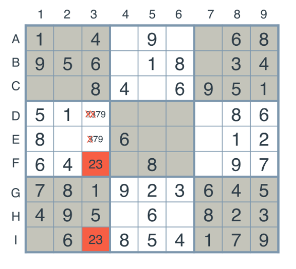
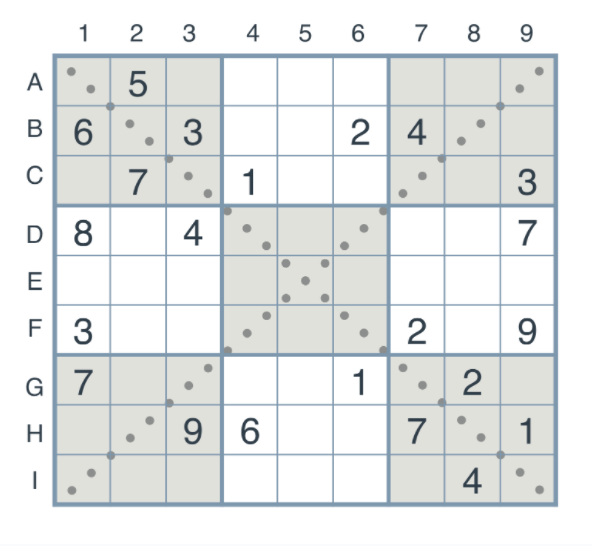

# Artificial Intelligence Nanodegree

## Project:

Congratulations on making it all the way through! You now have a program (Solving a Sudoku with AI.ipynb) that can solve any Sudoku puzzle! But can you extend your solution to include more heuristics? How about to solve a modified version of the puzzle?

For this project, you will implement some extensions to the Sudoku algorithm developed in the lectures. The first extension will be an implementation of the **naked twins** technique. The second will be a modification of the algorithm to solve a **diagonal sudoku.**

Navigate to the next page for details on how to get started and submit.

### Naked Twins

The [naked twins technique](http://www.sudokudragon.com/tutorialnakedtwins.htm) is the following. Consider the following puzzle, and look at the two highlighted boxes, 'F3' and 'I3'.


As we can see, both belong to the same column, and both permit the values of 2 and 3. Now, we don't know which one has a 2 and which one has a 3, but we know one thing for sure — the values 2 and 3 are locked in those two boxes, so no other box in their same unit (the third column) can contain the values 2 or 3.

Thus, we go over all the boxes in their same unit, and remove the values 2 and 3 from their possible values.



As you can see, we've removed the values 2 and 3 from the boxes 'D3' and 'E3'. This is the naked twins technique. In this project, you'll write a function that implements this technique.

### Diagonal Sudoku

A diagonal sudoku is like a regular sudoku, except that among the two main diagonals, the numbers 1 to 9 should all appear exactly once. In this project, you'll modify the functions we've written in the lecture (or you can write your own!) in order to solve every diagonal sudoku.



## Report:

## Introductory Project: Diagonal Sudoku Solver

# Question 1 (Naked Twins)
Q: How do we use constraint propagation to solve the naked twins problem?  
A: *Student should provide answer here*

# Question 2 (Diagonal Sudoku)
Q: How do we use constraint propagation to solve the diagonal sudoku problem?  
A: *Student should provide answer here*

### Install

This project requires **Python 3**.

We recommend students install [Anaconda](https://www.continuum.io/downloads), a pre-packaged Python distribution that contains all of the necessary libraries and software for this project. 
Please try using the environment we provided in the Anaconda lesson of the Nanodegree.

##### Optional: Pygame

Optionally, you can also install pygame if you want to see your visualization. If you've followed our instructions for setting up our conda environment, you should be all set.

If not, please see how to download pygame [here](http://www.pygame.org/download.shtml).

### Code

* `solutions.py` - You'll fill this in as part of your solution.
* `solution_test.py` - Do not modify this. You can test your solution by running `python solution_test.py`.
* `PySudoku.py` - Do not modify this. This is code for visualizing your solution.
* `visualize.py` - Do not modify this. This is code for visualizing your solution.

### Visualizing

To visualize your solution, please only assign values to the values_dict using the ```assign_values``` function provided in solution.py

### Data

The data consists of a text file of diagonal sudokus for you to solve.