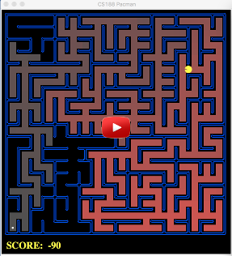

# Teaching Pac-Man to Search

This project is possible thanks to the generous contributions of the UC Berkeley AI division and their work on the [Pac-Man Project](http://inst.eecs.berkeley.edu/~cs188/pacman/project_overview.html).  Note: This project is implemented in python 2.7

## Result

## Commands

Try following commands with varying mazes and search algorithms

python pacman.py
python pacman.py --layout testMaze --pacman GoWestAgent
python pacman.py --layout tinyMaze --pacman GoWestAgent
python pacman.py -h
python pacman.py -l tinyMaze -p SearchAgent -a fn=tinyMazeSearch
python pacman.py -l tinyMaze -p SearchAgent
python pacman.py -l mediumMaze -p SearchAgent
python pacman.py -l bigMaze -z .5 -p SearchAgent
python pacman.py -l mediumMaze -p SearchAgent -a fn=bfs
python pacman.py -l bigMaze -p SearchAgent -a fn=bfs -z .5
python eightpuzzle.py
python pacman.py -l mediumMaze -p SearchAgent -a fn=ucs
python pacman.py -l mediumDottedMaze -p StayEastSearchAgent
python pacman.py -l mediumScaryMaze -p StayWestSearchAgent
python pacman.py -l bigMaze -z .5 -p SearchAgent -a fn=astar,heuristic=manhattanHeuristic 
python pacman.py -l tinyCorners -p SearchAgent -a fn=bfs,prob=CornersProblem
python pacman.py -l mediumCorners -p SearchAgent -a fn=bfs,prob=CornersProblem
python pacman.py -l mediumCorners -p AStarCornersAgent -z 0.5
python pacman.py -l testSearch -p AStarFoodSearchAgent
python pacman.py -l trickySearch -p AStarFoodSearchAgent
python pacman.py -l bigSearch -p ClosestDotSearchAgent -z .5 
python pacman.py -l bigSearch -p ApproximateSearchAgent -z .5 -q 

## Instructions

Follow the instructions for the problem set [here](https://inst.eecs.berkeley.edu/~cs188/fa10/projects/search/search.html)