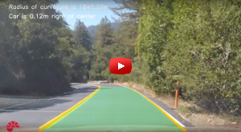
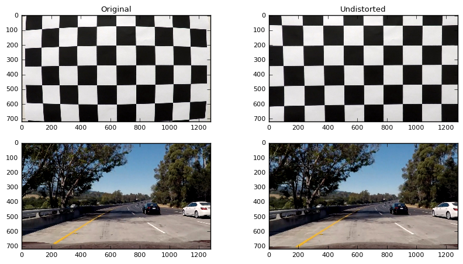
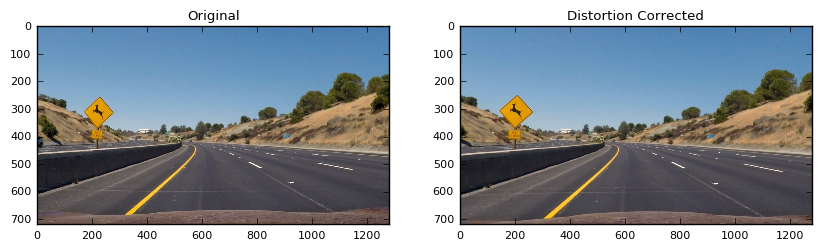
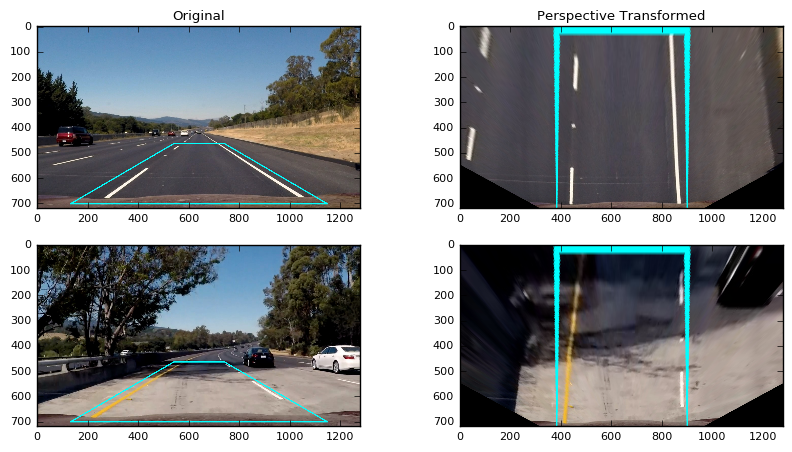
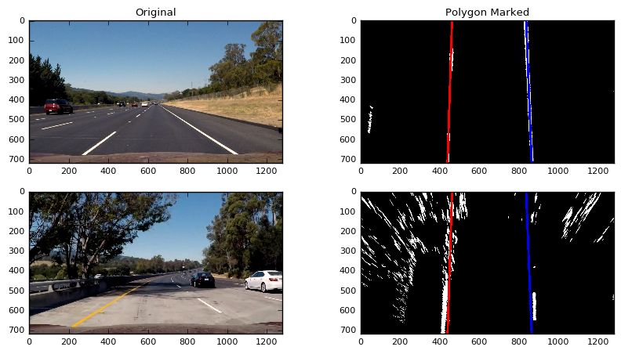
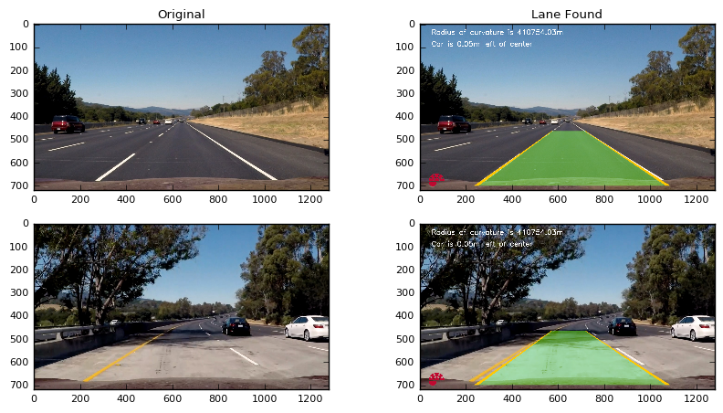

# Advanced Lane Finding

The goal of this project is to detect lane lines on videos through advance techniques such as color transforms, gradients, perspective transform and fitting polynomial. 

---

## Results

The following videos show the final results of the lanes being detected on three different tracks with varying difficulty:

Project Track                 |Challenge Track                |Harder Challenge Track <sup>*</sup>                   
:----------------------------:|:-----------------------------:|:------------------------------:
[](https://youtu.be/9OrWgTO0ZbY) | [](https://youtu.be/2cPPiAE76mk) | [](https://youtu.be/L_QP8J84Jj8)

The steps of this project are the following:

* Compute the camera calibration matrix and distortion coefficients given a set of chessboard images.
* Apply a distortion correction to raw images.
* Use color transforms, gradients, etc., to create a thresholded binary image.
* Apply a perspective transform to rectify binary image ("birds-eye view").
* Detect lane pixels and fit to find the lane boundary.
* Determine the curvature of the lane and vehicle position with respect to center.
* Warp the detected lane boundaries back onto the original image.
* Output visual display of the lane boundaries and numerical estimation of lane curvature and vehicle position.

## Report

Here I will consider the rubric points individually and describe how I addressed each point in my implementation.  

### Camera Calibration

Images or videos captured by a camera are typically distorted by the lens. Using a image like that would cause problems when trying to calculate the curvature or the car's offset to the center line. That's why it is important to undistort images first. For that a distortion matrix is calculated based on several images of a chessboard captured by the same camera. The matrix can then be used to undistort other images.

The code for this step is contained in [camera_calibrator.py](https://github.com/srikanthpagadala/udacity/blob/master/Self-Driving%20Car%20Engineer%20Nanodegree/AdvancedLaneLines-P4/source_code/camera_calibrator.py)

I start by preparing "object points", which will be the (x, y, z) coordinates of the chessboard corners in the world. Here I am assuming the chessboard is fixed on the (x, y) plane at z=0, such that the object points are the same for each calibration image.  Thus, `objp` is just a replicated array of coordinates, and `objpoints` will be appended with a copy of it every time I successfully detect all chessboard corners in a test image.  `imgpoints` will be appended with the (x, y) pixel position of each of the corners in the image plane with each successful chessboard detection.  

I then used the output `objpoints` and `imgpoints` to compute the camera calibration and distortion coefficients using the `cv2.calibrateCamera()` function.  I applied this distortion correction to the test image using the `cv2.undistort()` function and obtained this result: 



### Pipeline 

Let us now go over individual steps of lane detection pipeline.

#### Distortion Correction

The code for this step is contained in [camera_calibrator.py](https://github.com/srikanthpagadala/udacity/blob/master/Self-Driving%20Car%20Engineer%20Nanodegree/AdvancedLaneLines-P4/source_code/camera_calibrator.py). Camera images are calibrated in the function `calibrate_camera()` (lines 77 through 111) using provided chessboard images. Then frames from the car videos are corrected by applying the calculated distortion matrix in `undistort()` (lines 32 through 36) function. 



#### Lane Mask Generation

In this step, I used a combination of color and gradient thresholds to generate a binary image mask that can be used to extract lane pixels from a given video frame. 

The code for Lane Mask Generation is contained in [mask_generator.py](https://github.com/srikanthpagadala/udacity/blob/master/Self-Driving%20Car%20Engineer%20Nanodegree/AdvancedLaneLines-P4/source_code/mask_generator.py). It combines various techniques like sobel operations, color transforms, gradients, color extraction and noise reduction to generate an image mask. Through a lot of trial and error, various thresholds are chosen. `generate_lane_mask()` function in lines 113 through 147 is the entry point. It makes use of other helper functions in the same file to generate the combined mask image. Following is a brief description of each sub-step in order of execution:

- **Color Channel Selection:** An averaged gray scale image from the U and V color channels of the YUV space and also the S channel of the HLS space is used as input. Through some experimentation these channels were found to have brighter and clearer lane edges. (lines 120 through 125)

- **Sobel Operation:** This detects edges by computing approximate gradient of the image intensity function. It is applied in both x and y directions and combined to keep pixels that appear in both results and over certain threshold. (lines 7 through 24)

- **Gradient Magnitude & Direction:** The magnitude and direction of the gradient is calculated and combined by keeping only pixels within respective thresholds. (lines 26 through 49)

- **Color Isolation:** Through basic color thresholding yellow lane pixels are isolated. (lines 62 through 71)

- **High Intensity Detection:** In order to make process more resilient against different lighting conditions, all the pixels which have values above a given percentile are isolated. (lines 85 through 94)

- **Noise Reduction:** Used a 2d filter to reduce the noise in the image. (lines 97 through 110)

In the end, the results are combined through a bitwise OR operation to get the final lane mask. (lines 138 through 143)


#### Perspective Transformation

The code for my perspective transform includes a function called `transform()`, which appears in lines 30 through 31 in the file [perspective_transformer.py](https://github.com/srikanthpagadala/udacity/blob/master/Self-Driving%20Car%20Engineer%20Nanodegree/AdvancedLaneLines-P4/source_code/perspective_transformer.py).  The `transform()` function takes as inputs an image (`img`), as well as source (`src`) and destination (`dst`) points.  Through experimentation, I chose to hardcode the source and destination points in the following manner:

```
OFFSET = 250

PERSPECTIVE_SRC = np.float32([
                    (132, 703),
                    (540, 466),
                    (740, 466),
                    (1147, 703)])

PERSPECTIVE_DST = np.float32([
                    (PERSPECTIVE_SRC[0][0] + OFFSET, 720),
                    (PERSPECTIVE_SRC[0][0] + OFFSET, 0),
                    (PERSPECTIVE_SRC[-1][0] - OFFSET, 0),
                    (PERSPECTIVE_SRC[-1][0] - OFFSET, 720)])
```

I verified that my perspective transform was working as expected by drawing the `src` and `dst` points onto a test image and its warped counterpart to verify that the lines appear parallel in the warped image.



#### Pixel Histogram Analysis

The code for this step is contained in [histogram_utils.py](https://github.com/srikanthpagadala/udacity/blob/master/Self-Driving%20Car%20Engineer%20Nanodegree/AdvancedLaneLines-P4/source_code/utils/histogram_utils.py).

Not all pixels that appear in the binary mask belong to lanes. There is still lot of noise in the mask. In order to identify the lane pixels, a sliding window technique as described by Cezanne is applied. The highest peak of each histogram is used as the center of a window which assigns every pixel inside it to the corresponding lane. This process is applied to the left half of the image to detect left lane pixels and then repeated on the right half of the image to detect right lane pixels. This is implemented in `histogram_lane_detection()` function in lines 6 through 39. 

The process described above is bit slow to apply to each and every frame of the video. As an optimization, algorithm tries to find lane pixels in subsequent frame along the previously found lines first. This implementation can be found in [lane_utils.py](https://github.com/srikanthpagadala/udacity/blob/master/Self-Driving%20Car%20Engineer%20Nanodegree/AdvancedLaneLines-P4/source_code/utils/lane_utils.py) in function `detect_lane_along_poly()` (lines 7 through 31).

#### Polynomial Fitting

Once all the pixel coordinates (x, y) have been assigned to respective lanes, a second order polynomial is fitted. This is our line of detected lanes. For smoother results, polynomials are averaged over last few frames. This polynomial is also used to calculate the radius of curvature of the lane and car's offset from the center of the lane. 

The code for this step is contained in [line.py](https://github.com/srikanthpagadala/udacity/blob/master/Self-Driving%20Car%20Engineer%20Nanodegree/AdvancedLaneLines-P4/source_code/utils/line.py) and [lane_utils.py](https://github.com/srikanthpagadala/udacity/blob/master/Self-Driving%20Car%20Engineer%20Nanodegree/AdvancedLaneLines-P4/source_code/utils/lane_utils.py). Few lines of interest are following:

```
self.current_fit = np.polyfit(self.allx, self.ally, 2)

if self.best_fit is None:
    self.best_fit = self.current_fit
else:
    self.best_fit = (self.best_fit * (self.n_frames - 1) + self.current_fit) / self.n_frames
```



#### Final Step: Overlay & Inverse Transformation

The code for this step is contained in [lane_finder.py](https://github.com/srikanthpagadala/udacity/blob/master/Self-Driving%20Car%20Engineer%20Nanodegree/AdvancedLaneLines-P4/source_code/lane_finder.py). In function `render_predicted_lane_area()` lines 47 through 68, I overlay the computed polynomial lane area in Green and Lanes itself in Yellow. Then we unwarp the processed image to its original perspective. That's it!



---

### Conclusion

This was a bit tricky project. It involved a lot of trial and error in finding the right thresholds to make the pipeline work. There are so many hyper-parameters to tune that I think this approach is not very robust. Although, this mechanical approach finally worked out for first two videos, I have a suspicion that it may not work for real wild world. I think Neural Network based approach is fitting for this problem. In my next version, I'll try to find a Neural Network based solution.

The harder challenge video is very tricky. I could not make it to work. Current hyper-parameters (various algorithm thresholds) are not able to extract lane pixels correctly. With enough time and perseverance I might be able to tackle it.
