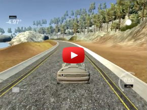
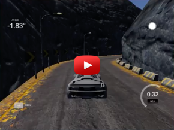

[Report](https://srikanthpagadala.github.io/serve/carnd-behavioral-cloning-p3-report.html)

# Deep Learning to Clone Driving Behavior

In this project we will Train a deep neural network to drive a car like us!

The goal is to drive a car autonomously in a simulator using a deep neural network trained on human driving behavior. Udacity has provided a simulator and a python script (drive.py) that connects our DNN with the simulator. The simulator has two modes. In the "training mode" on track-1 the car can be controlled through a keyboard to generate training data. Training data consists of images captured by three cameras mounted on the car and corresponding steering angle. A model is trained on the training data that can be used to predict steering angles while driving on unseen track-2 in simulator.

## Problem Statement

I took upon myself to find a solution that will be extremely light weight. It should not require any powerful GPU machine or Amazon EC2 instance. It should run easily on my 2012 MBP with 8 GB memory. Yet it should be fast. Each epoch should not take more than 2mins. Also, for the design and model architecture, I refused to entertain any idea or concept that were not taught in the class. Although, I do assume that you have atleast taken "Intro to Machine Learning" class. It should be a required prerequisite IMHO.

## Result

The following videos show the final model driving the car autonomously on two different tracks:

Track 1                       |  Track 2
:----------------------------:|:------------------------------:
 | 

## Report

[Report](https://srikanthpagadala.github.io/serve/carnd-behavioral-cloning-p3-report.html)