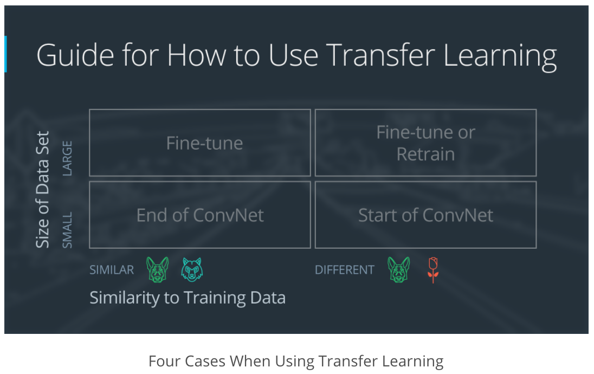

## Congratulations!

You've trained AlexNet, VGG, GoogLeNet, and ResNet as feature extractors!

To end this lab, let's summarize when we should consider:

Feature extraction (train only the top-level of the network, the rest of the network remains fixed)
Finetuning (train the entire network end-to-end, start with pre-trained weights)
Training from scratch (train the entire network end-to-end, start from random weights)
Consider feature extraction when ...

... the new dataset is small and similar to the original dataset. The higher-level features learned from the original dataset should transfer well to the new dataset.

Consider finetuning when ...

... the new dataset is large and similar to the original dataset. Altering the original weights should be safe because the network is unlikely to overfit the new, large dataset.

... the new dataset is small and very different from the original dataset. You could also make the case for training from scratch. If you choose to finetune, it might be a good idea to only use features from the first few layers of the pre-trained network; features from the final layers of the pre-trained network might be too specific to the original dataset.

Consider training from scratch when ...

... the dataset is large and very different from the original dataset. In this case we have enough data to confidently train from scratch. However, even in this case it might be beneficial to initialize the entire network with pretrained weights and finetune it on the new dataset.

Finally, keep in mind that for a lot of problems you won't need an architecture as complicated and powerful as VGG, Inception, or ResNet. These architectures were made for the task of classifying thousands of complex classes. A smaller network might be a better fit for a smaller problem, especially if you can comfortably train it on moderate hardware.